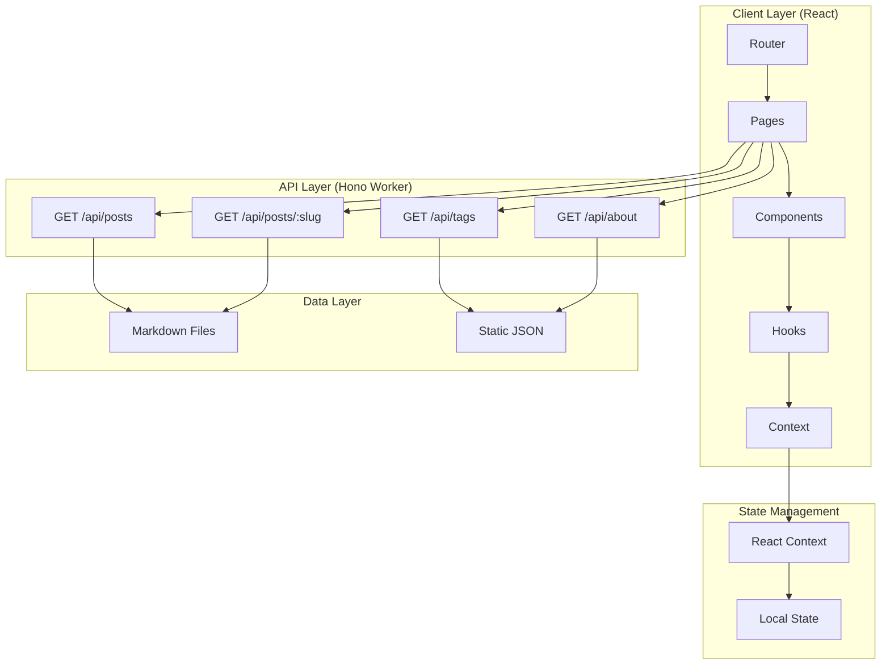
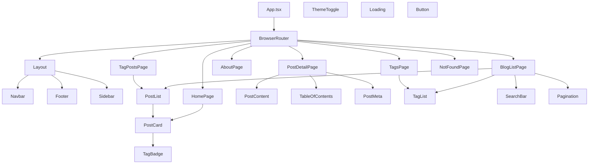
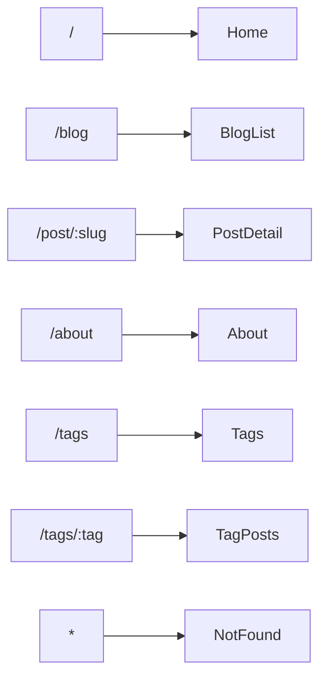

# Personal Blog - Technical Architecture Design

## 1. System Architecture Overview



### Technology Stack

| Layer | Technology | Version |
|-------|------------|---------|
| Frontend Framework | React | 19.x |
| Build Tool | Vite | 6.x |
| Language | TypeScript | 5.x |
| Routing | React Router DOM | 7.x |
| Animation | Framer Motion | 12.x |
| Markdown | react-markdown | 10.x |
| Code Highlighting | react-syntax-highlighter | 15.x |
| Icons | Lucide React | 0.468.x |
| Date Handling | date-fns | 4.x |
| Backend | Hono | 4.x |
| Deployment | Cloudflare Workers | - |

---

## 2. Component Hierarchy



---

## 3. Data Models

### Post Interface

```typescript
interface Post {
  slug: string;           // URL-friendly identifier
  title: string;           // Post title
  description: string;    // Short summary (150 chars)
  content: string;        // Markdown content
  coverImage?: string;    // Optional cover image URL
  date: string;           // ISO date string
  tags: string[];         // Array of tag names
  readingTime: number;    // Estimated reading time in minutes
  views: number;          // View count
  author: Author;         // Author information
}

interface Author {
  name: string;
  avatar: string;
  bio: string;
  github?: string;
  twitter?: string;
  email?: string;
}

interface Tag {
  name: string;
  count: number;
  color?: string;
}
```

### API Response Types

```typescript
// GET /api/posts
interface PostsResponse {
  posts: Post[];
  total: number;
  page: number;
  pageSize: number;
  hasMore: boolean;
}

// GET /api/posts/:slug
interface PostResponse {
  post: Post;
  prevPost?: Post;
  nextPost?: Post;
}

// GET /api/tags
interface TagsResponse {
  tags: Tag[];
}
```

---

## 4. Pages & Routes



| Route | Page | Description |
|-------|------|-------------|
| `/` | HomePage | Landing page with hero and recent posts |
| `/blog` | BlogListPage | All posts with pagination and filters |
| `/post/:slug` | PostDetailPage | Full article with TOC |
| `/about` | AboutPage | About the author |
| `/tags` | TagsPage | All tags with counts |
| `/tags/:tag` | TagPostsPage | Posts filtered by tag |
| `*` | NotFoundPage | 404 page |

---

## 5. Visual Design System

### Color Palette (Dark Theme - Primary)

```css
:root {
  /* Primary Gradient */
  --gradient-primary: linear-gradient(135deg, #667eea 0%, #764ba2 100%);
  --gradient-accent: linear-gradient(135deg, #f093fb 0%, #f5576c 100%);
  --gradient-hero: linear-gradient(135deg, #1a1a2e 0%, #16213e 50%, #0f3460 100%);
  
  /* Brand Colors */
  --primary: #6366f1;
  --primary-light: #818cf8;
  --primary-dark: #4f46e5;
  --accent: #f472b6;
  --accent-light: #f9a8d4;
  
  /* Background - Deep Night Sky */
  --bg-primary: #0a0a0f;
  --bg-secondary: #12121a;
  --bg-tertiary: #1a1a24;
  --bg-card: #15151f;
  --bg-card-hover: #1c1c28;
  
  /* Glass Effect */
  --glass-bg: rgba(255, 255, 255, 0.03);
  --glass-border: rgba(255, 255, 255, 0.08);
  --glass-blur: blur(20px);
  
  /* Text Colors */
  --text-primary: #f1f5f9;
  --text-secondary: #94a3b8;
  --text-muted: #64748b;
  --text-accent: #a5b4fc;
  
  /* Semantic Colors */
  --success: #10b981;
  --warning: #f59e0b;
  --error: #ef4444;
  --info: #3b82f6;
  
  /* Code */
  --code-bg: #1e1e2e;
  --code-text: #cdd6f4;
  
  /* Shadows */
  --shadow-sm: 0 1px 2px rgba(0, 0, 0, 0.3);
  --shadow-md: 0 4px 6px -1px rgba(0, 0, 0, 0.4);
  --shadow-lg: 0 10px 15px -3px rgba(0, 0, 0, 0.5);
  --shadow-glow: 0 0 40px rgba(99, 102, 241, 0.15);
  
  /* Border Radius */
  --radius-sm: 6px;
  --radius-md: 12px;
  --radius-lg: 20px;
  --radius-full: 9999px;
}
```

### Typography

```css
:root {
  /* Font Families */
  --font-sans: 'Inter', -apple-system, BlinkMacSystemFont, 'Segoe UI', sans-serif;
  --font-mono: 'JetBrains Mono', 'Fira Code', 'Consolas', monospace;
  --font-chinese: 'Noto Sans SC', 'PingFang SC', 'Microsoft YaHei', sans-serif;
  
  /* Font Sizes */
  --text-xs: 0.75rem;      /* 12px */
  --text-sm: 0.875rem;     /* 14px */
  --text-base: 1rem;       /* 16px */
  --text-lg: 1.125rem;     /* 18px */
  --text-xl: 1.25rem;      /* 20px */
  --text-2xl: 1.5rem;       /* 24px */
  --text-3xl: 1.875rem;    /* 30px */
  --text-4xl: 2.25rem;     /* 36px */
  --text-5xl: 3rem;        /* 48px */
  
  /* Line Heights */
  --leading-tight: 1.25;
  --leading-normal: 1.5;
  --leading-relaxed: 1.75;
}
```

### Spacing System

```css
:root {
  --space-1: 0.25rem;   /* 4px */
  --space-2: 0.5rem;    /* 8px */
  --space-3: 0.75rem;   /* 12px */
  --space-4: 1rem;      /* 16px */
  --space-5: 1.25rem;   /* 20px */
  --space-6: 1.5rem;    /* 24px */
  --space-8: 2rem;      /* 32px */
  --space-10: 2.5rem;   /* 40px */
  --space-12: 3rem;     /* 48px */
  --space-16: 4rem;     /* 64px */
  --space-20: 5rem;     /* 80px */
}
```

### Responsive Breakpoints

```css
/* Mobile First */
:root {
  --breakpoint-sm: 640px;   /* Small tablets */
  --breakpoint-md: 768px;   /* Tablets */
  --breakpoint-lg: 1024px;  /* Laptops */
  --breakpoint-xl: 1280px;  /* Desktops */
  --breakpoint-2xl: 1536px; /* Large screens */
}
```

---

## 6. Component Specifications

### Navbar

- **Height**: 64px fixed
- **Background**: `glass-bg` with `glass-blur`
- **Border**: 1px `glass-border` at bottom
- **Content**: Logo (left), Navigation links (center), Theme toggle (right)
- **Behavior**: Transparent on hero, solid on scroll
- **Mobile**: Hamburger menu with slide-in drawer

### PostCard

- **Size**: Full width on mobile, 2-3 columns on desktop
- **Background**: `bg-card`
- **Border**: 1px `glass-border`
- **Border Radius**: `radius-lg`
- **Hover**: Scale 1.02, shadow-glow, border-color change
- **Transition**: 300ms ease-out

### PostContent

- **Max Width**: 768px centered
- **Typography**: 
  - Headings: `font-sans`, `font-weight: 700`
  - Body: `font-sans`, `font-size: text-lg`, `leading-relaxed`
  - Code: `font-mono`, `code-bg` background
- **Images**: Max width 100%, rounded corners
- **Blockquotes**: Left border accent, italic text

### TableOfContents

- **Position**: Sticky sidebar on desktop
- **Sticky Offset**: 80px from top
- **Items**: Clickable, highlight current section
- **Animation**: Smooth scroll to section

### Footer

- **Background**: `bg-secondary`
- **Padding**: `space-12` vertical
- **Content**: Copyright, Social links, Built with love
- **Border**: 1px `glass-border` at top

---

## 7. Animation Specifications

### Page Transitions

```typescript
const pageVariants = {
  initial: { 
    opacity: 0, 
    y: 20 
  },
  animate: { 
    opacity: 1, 
    y: 0,
    transition: {
      duration: 0.4,
      ease: [0.25, 0.1, 0.25, 1]
    }
  },
  exit: { 
    opacity: 0, 
    y: -20,
    transition: {
      duration: 0.3
    }
  }
};
```

### Hover Effects

```typescript
// Button hover
const buttonHover = {
  scale: 1.02,
  boxShadow: '0 0 30px rgba(99, 102, 241, 0.3)',
  transition: { duration: 0.2 }
};

// Card hover
const cardHover = {
  y: -4,
  boxShadow: 'var(--shadow-glow)',
  borderColor: 'var(--primary)',
  transition: { duration: 0.3 }
};
```

### Stagger Children

```typescript
const staggerContainer = {
  animate: {
    transition: {
      staggerChildren: 0.1
    }
  }
};

const staggerItem = {
  initial: { opacity: 0, y: 20 },
  animate: { 
    opacity: 1, 
    y: 0,
    transition: { duration: 0.4 }
  }
};
```

---

## 8. Project Structure

```
src/
├── react-app/
│   ├── components/
│   │   ├── Layout/
│   │   │   ├── Navbar.tsx
│   │   │   ├── Footer.tsx
│   │   │   ├── Layout.tsx
│   │   │   └── index.ts
│   │   ├── Post/
│   │   │   ├── PostCard.tsx
│   │   │   ├── PostList.tsx
│   │   │   ├── PostContent.tsx
│   │   │   ├── PostMeta.tsx
│   │   │   ├── PostTOC.tsx
│   │   │   └── index.ts
│   │   ├── Tag/
│   │   │   ├── TagBadge.tsx
│   │   │   ├── TagList.tsx
│   │   │   └── index.ts
│   │   ├── Common/
│   │   │   ├── Button.tsx
│   │   │   ├── Loading.tsx
│   │   │   ├── SearchBar.tsx
│   │   │   ├── Pagination.tsx
│   │   │   ├── ThemeToggle.tsx
│   │   │   ├── SEO.tsx
│   │   │   └── index.ts
│   │   └── index.ts
│   ├── pages/
│   │   ├── Home/
│   │   │   ├── Home.tsx
│   │   │   ├── Hero.tsx
│   │   │   ├── RecentPosts.tsx
│   │   │   └── index.ts
│   │   ├── BlogList/
│   │   │   ├── BlogList.tsx
│   │   │   ├── FilterBar.tsx
│   │   │   └── index.ts
│   │   ├── PostDetail/
│   │   │   ├── PostDetail.tsx
│   │   │   ├── PostNavigation.tsx
│   │   │   └── index.ts
│   │   ├── About/
│   │   │   ├── About.tsx
│   │   │   └── index.ts
│   │   ├── Tags/
│   │   │   ├── Tags.tsx
│   │   │   └── index.ts
│   │   ├── TagPosts/
│   │   │   ├── TagPosts.tsx
│   │   │   └── index.ts
│   │   ├── NotFound/
│   │   │   ├── NotFound.tsx
│   │   │   └── index.ts
│   │   └── index.ts
│   ├── hooks/
│   │   ├── usePosts.ts
│   │   ├── usePost.ts
│   │   ├── useTags.ts
│   │   ├── useTheme.ts
│   │   ├── useReadingProgress.ts
│   │   └── index.ts
│   ├── context/
│   │   ├── ThemeContext.tsx
│   │   └── index.ts
│   ├── services/
│   │   ├── api.ts
│   │   └── index.ts
│   ├── types/
│   │   ├── post.ts
│   │   ├── author.ts
│   │   ├── tag.ts
│   │   ├── api.ts
│   │   └── index.ts
│   ├── data/
│   │   ├── posts/
│   │   │   ├── hello-world.md
│   │   │   ├── react-19-guide.md
│   │   │   └── typescript-tips.md
│   │   ├── authors.ts
│   │   └── index.ts
│   ├── styles/
│   │   ├── globals.css
│   │   ├── variables.css
│   │   ├── animations.css
│   │   ├── prism-theme.css
│   │   └── index.css
│   ├── utils/
│   │   ├── markdown.ts
│   │   ├── date.ts
│   │   ├── slug.ts
│   │   └── index.ts
│   ├── App.tsx
│   ├── main.tsx
│   └── router.tsx
├── worker/
│   ├── index.ts
│   ├── routes/
│   │   ├── posts.ts
│   │   ├── tags.ts
│   │   └── about.ts
│   ├── data/
│   │   └── posts.ts
│   └── types.ts
└── public/
    ├── images/
    │   └── avatar.jpg
    └── favicon.ico
```

---

## 9. Implementation Priority

### Phase 1: Foundation (Week 1)

- [ ] Setup project structure
- [ ] Configure CSS variables and global styles
- [ ] Implement Layout components (Navbar, Footer)
- [ ] Setup React Router
- [ ] Create basic pages (Home, NotFound)

### Phase 2: Core Features (Week 2)

- [ ] Implement PostCard and PostList components
- [ ] Build BlogList page with pagination
- [ ] Create PostDetail page with markdown rendering
- [ ] Add code syntax highlighting
- [ ] Implement TableOfContents

### Phase 3: Content & Tags (Week 3)

- [ ] Create sample markdown posts
- [ ] Implement tag system
- [ ] Build Tags page
- [ ] Add search functionality
- [ ] Implement About page

### Phase 4: Polish (Week 4)

- [ ] Add Framer Motion animations
- [ ] Implement page transitions
- [ ] Add loading states
- [ ] Optimize responsive design
- [ ] Add SEO meta tags
- [ ] Test and fix bugs

---

## 10. Key Design Highlights

### Glass Morphism Cards

```css
.glass-card {
  background: var(--glass-bg);
  backdrop-filter: var(--glass-blur);
  -webkit-backdrop-filter: var(--glass-blur);
  border: 1px solid var(--glass-border);
  border-radius: var(--radius-lg);
}
```

### Gradient Text

```css
.gradient-text {
  background: var(--gradient-primary);
  -webkit-background-clip: text;
  -webkit-text-fill-color: transparent;
  background-clip: text;
}
```

### Glowing Border

```css
.glow-border {
  position: relative;
}

.glow-border::before {
  content: '';
  position: absolute;
  inset: -1px;
  border-radius: inherit;
  padding: 1px;
  background: var(--gradient-primary);
  -webkit-mask: linear-gradient(#fff 0 0) content-box, linear-gradient(#fff 0 0);
  -webkit-mask-composite: xor;
  mask-composite: exclude;
  opacity: 0;
  transition: opacity 0.3s ease;
}

.glow-border:hover::before {
  opacity: 1;
}
```

---

This architecture provides a solid foundation for building a beautiful, performant personal blog with modern aesthetics and smooth user experience.
